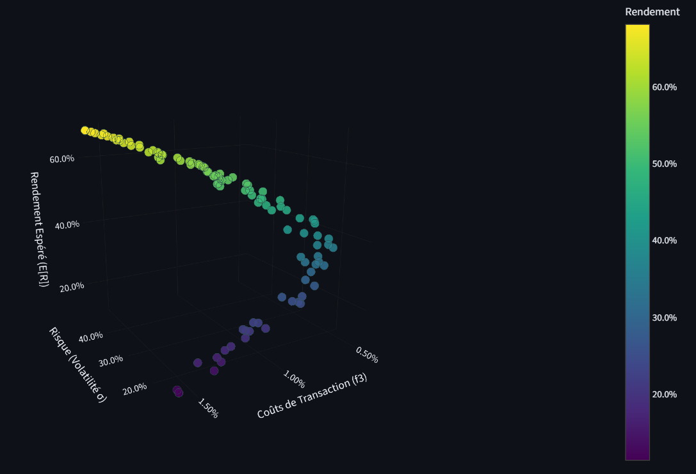
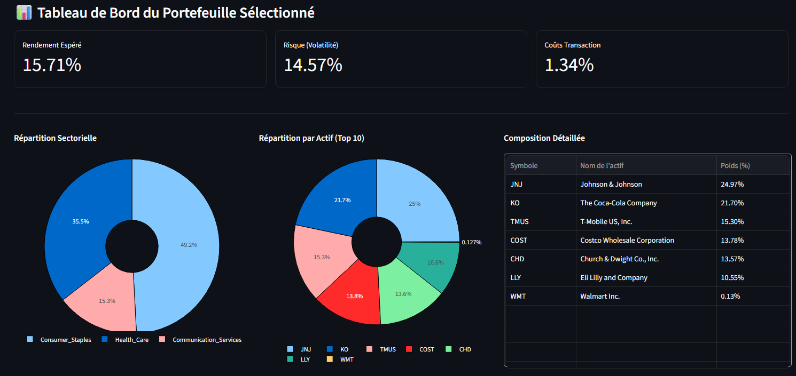

# Optimisation de Portefeuille Multi-Objectifs (NSGA-II)


> Application d'optimisation de portefeuille financier utilisant l'algorithme génétique NSGA-II, de la théorie de Markowitz aux contraintes réelles (cardinalité, coûts de transaction).

---

## Objectif du Projet

Construire un outil d'aide à la décision pour investisseurs qui :
1. **Calcule le Front de Pareto** optimal entre Rendement, Risque et Coûts
2. **Respecte des contraintes réalistes** (max K actifs parmi 190)
3. **Visualise les compromis** en 3D de manière interactive

**Données** : 190 actions du S&P 500 (Tech, Santé, Conso...), période 2015-2024.

---

## Démonstration

### Application en Action


### Front de Pareto 3D


### Dashboard de Sélection



---

## Approche Progressive

Le projet démontre une progression méthodique :

| Niveau | Approche | Fichier |
|:---:|:---|:---:|
| 1 | Markowitz (Moyenne-Variance) | `notebooks/niveau_1_markowitz.ipynb` |
| 2 | NSGA-II + Contraintes | `notebooks/niveau_2_couts_card.ipynb` |
| 3 | Application Interactive | `streamlit_app.py` |

### Niveau 1 : Théorie Classique (Markowitz)
- Résolution via **SLSQP** (scipy) - problème convexe
- Frontière Efficiente & Portefeuille Max Sharpe
- **Limitation** : Ignore les coûts, investit dans tous les actifs

### Niveau 2 : Algorithme Génétique (NSGA-II)
- Résolution via **NSGA-II** (pymoo) - problème NP-difficile
- **3 objectifs simultanés** : Max Rendement, Min Risque, Min Coûts
- **Contrainte de Cardinalité** : Sélectionne exactement K actifs (ex: 10/190)
- **Résultat clé** : NSGA-II trouve ~30% de rendement là où Monte Carlo plafonne à ~15-20%

### Niveau 3 : Dashboard Streamlit
- Visualisation 3D interactive (Plotly)
- Sélection dynamique des paramètres (K, coûts)
- Analyse détaillée par secteur et par actif

---

## Formalisation Mathématique

Le portefeuille est défini par un vecteur de poids `w ∈ R^N` (N=190 actifs).

| Objectif | Formule | Description |
|:---|:---|:---|
| f₁ (Rendement) | `min -wᵀμ` | Maximiser le rendement espéré |
| f₂ (Risque) | `min wᵀΣw` | Minimiser la variance (volatilité²) |
| f₃ (Coûts) | `min Σ|wᵢ - wᵢ_prev|` | Minimiser le turnover vs portefeuille initial |

**Contraintes** :
- Budget : `Σwᵢ = 1` (100% investi)
- Long-only : `wᵢ ≥ 0` (pas de vente à découvert)
- Cardinalité : Exactement K actifs avec poids > 0

---

## Installation et Démarrage

### Pré-requis
- **Option 1 (Recommandé)** : [Docker Desktop](https://www.docker.com/products/docker-desktop)
- **Option 2** : Python 3.12+

### Lancement via Docker (1 commande)

```bash
# Windows (PowerShell)
.\run.ps1

# Mac / Linux
chmod +x run.sh && ./run.sh
```

### Lancement Local (sans Docker)

```bash
pip install -r requirements.txt
python src/prepare_data.py
python -m streamlit run streamlit_app.py
```

---

## Tests

Le projet inclut une suite de tests automatisés :

```bash
# Lancer les tests localement
pytest tests/ -v
```

Les tests vérifient :
- ✅ Validité des poids (somme = 1, tous ≥ 0)
- ✅ Respect de la contrainte de cardinalité (K actifs max)
- ✅ Diversité du Front de Pareto (plusieurs solutions)

**CI/CD** : Les tests sont lancés automatiquement à chaque push via GitHub Actions.

---

## Structure du Projet

```
├── streamlit_app.py        # Application interactive
├── src/
│   ├── portfolio_lib.py    # Algorithme NSGA-II (Pymoo)
│   ├── data_prep.py        # Préparation des données
│   └── prepare_data.py     # Script de génération
├── tests/
│   └── test_portfolio_lib.py  # Tests unitaires
├── notebooks/
│   ├── niveau_1_markowitz.ipynb
│   └── niveau_2_couts_card.ipynb
├── .github/workflows/ci.yml   # CI/CD GitHub Actions
├── Dockerfile & docker-compose.yml
└── run.ps1 / run.sh           # Scripts de lancement
```

---

## Fonctionnalités Clés

| Fonctionnalité | Description |
|:---|:---|
| **Optimisation Multi-Objectifs** | 3 objectifs contradictoires optimisés simultanément |
| **Contrainte de Cardinalité** | Limite le nombre d'actifs (ex: top 10) |
| **Coûts de Transaction** | Prise en compte des frais de courtage réels |
| **Visualisation 3D** | Exploration interactive des compromis (trade-offs) |
| **Tests Automatisés** | Suite pytest + CI/CD GitHub Actions |

---

## Pour Aller Plus Loin

1. **Explorer les notebooks** pour comprendre la théorie
2. **Modifier `k_card`** dans l'app pour voir l'impact de la diversification
3. **Analyser les secteurs** dans le Dashboard pour comprendre les allocations